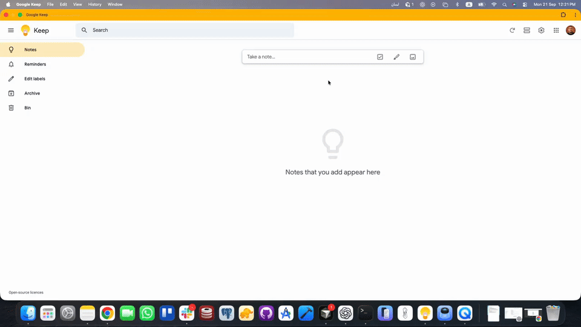

# lisan (لسان)

**lisan** ("tongue/language" in Arabic) is a lightweight macOS background
script that watches what you type and, on **Space**, transliterates the
last Latin-alphabet word into Arabic — swapping it directly into whatever
text field you're typing in (Notes, WhatsApp, Messages, browser, etc.).

Type `marhaba` + `Space` → it becomes `مرحبا`, right where you were typing.



🌐 **[Docs](https://ahmadfreijeh.github.io/lisan/)**

## What it does

- Runs in the background and globally listens to your keystrokes.
- Buffers letters as you type a word.
- When you press **Space**, it sends the buffered word to
  [Yamli](https://www.yamli.com/)'s transliteration API to get the Arabic
  equivalent.
- It erases the Latin word you just typed (via synthetic Backspaces) and
  types the Arabic result in its place, followed by a space.
- Non-alphabetic keys (punctuation, arrows, enter, etc.) reset the current
  word buffer.
- To avoid feeling laggy, it types an instant "…" placeholder the moment
  you press Space, then swaps it out for the real Arabic word once the
  network lookup finishes (or restores your original word if nothing was
  found).
- Right after a swap, press **F2** to cycle through alternate Arabic
  candidates for that word, in case the first guess wasn't the one you
  wanted.
- Optionally, you can restrict it to only work inside one specific app (see
  [Restricting to a specific app](#restricting-to-a-specific-app) below).

## Requirements

- macOS
- Python 3.9+
- Packages: `pynput`, `requests`, `urllib3`, `rumps` (for the menu bar app)

## Setup (macOS)

1. **Clone the repo**

   ```bash
   git clone https://github.com/ahmadfreijeh/lisan.git
   cd lisan
   ```

2. **Install dependencies**

   ```bash
   pip3 install -r requirements.txt
   ```

3. **Grant macOS permissions**

   `lisan` uses [`pynput`](https://pypi.org/project/pynput/), which relies on
   macOS Accessibility APIs to both listen to global keystrokes and inject
   synthetic ones. The exact binary running the script (e.g. your
   `python3`, or your terminal app) must be granted:

   - **System Settings > Privacy & Security > Accessibility**
   - **System Settings > Privacy & Security > Input Monitoring**

   When you first run the script, it prints the exact Python executable
   path it's running from — add **that exact path** to both panes above
   (use `Cmd+Shift+G` in the file picker to paste the path directly, since
   pyenv/venv binaries are often hidden from the normal picker).

   After granting permissions, fully quit (`Ctrl+C`) and restart the
   script — macOS caches trust at process launch.

4. **Run it**

   ```bash
   python3 lisan.py
   ```

   Then type a word (e.g. `marhaba`) in any focused text field and press
   `Space`. lisan will replace it with `مرحبا`.

   Stop the script anytime with `Ctrl+C` in the terminal running it.

## Menu bar app (toggle on/off, click-to-pick suggestions)

Instead of running `lisan.py` from a terminal, you can run it as a small
menu bar app:

```bash
python3 lisan_app.py
```

This puts a "لسان" icon in your menu bar with:

- **Start / Stop** — lisan is completely inactive until you click Start.
  Click Stop anytime to pause it without quitting the app.
- **Suggestions** — after each swap, this submenu fills with the
  alternate Arabic candidates for that word (e.g. `1. مرحبا`,
  `2. مرحبة`, ...). Click one to swap it in instead of the default —
  same idea as the `F2` hotkey, just clickable.
- **Run in** — restrict lisan to one app, live (no restart needed):
  quick picks for **All Apps**, **Notes**, **WhatsApp**, **Messages**,
  **Mail**, **Safari**, plus **Custom App...** to type any other app
  name. A checkmark shows the active choice.
- **Quit** — stops lisan (if running) and exits.

It needs the same Accessibility / Input Monitoring permissions described
above, granted to whichever Python binary runs `lisan_app.py`.

## Restricting to a specific app

By default, lisan is active everywhere. If you only want it to run inside
one specific app, pass its name with `--app` / `-a`. Matching is a
case-insensitive substring match against the frontmost app's name.

```bash
python3 lisan.py --app "WhatsApp"
```

With this flag, lisan only transliterates while **WhatsApp** is the
frontmost (focused) app. Typing in any other app is left untouched. Omit
the flag to go back to working in every app.

Other examples:

```bash
python3 lisan.py --app Notes      # only in Notes.app
python3 lisan.py -a Messages      # only in Messages.app
python3 lisan.py                  # active everywhere (default)
```

## Suggestions / alternate candidates

Yamli usually returns more than one possible Arabic spelling for a word.
lisan swaps in the top-ranked one automatically, but you're not stuck with
it: immediately after a swap, tap **F2** one or more times to cycle through
the other candidates (wrapping back to the first after the last one).

This only works right after a swap — typing anything else (or another
word) resets it, since at that point the cursor is no longer guaranteed to
be right after the swapped word.

## Notes

- TLS certificate verification is intentionally disabled for the Yamli
  request (Yamli's certs are sometimes outdated); the corresponding
  `InsecureRequestWarning` is suppressed.
- Password fields and other "secure input" contexts on macOS block
  synthetic keystrokes system-wide — this is a macOS-level protection
  lisan cannot (and should not attempt to) bypass.
