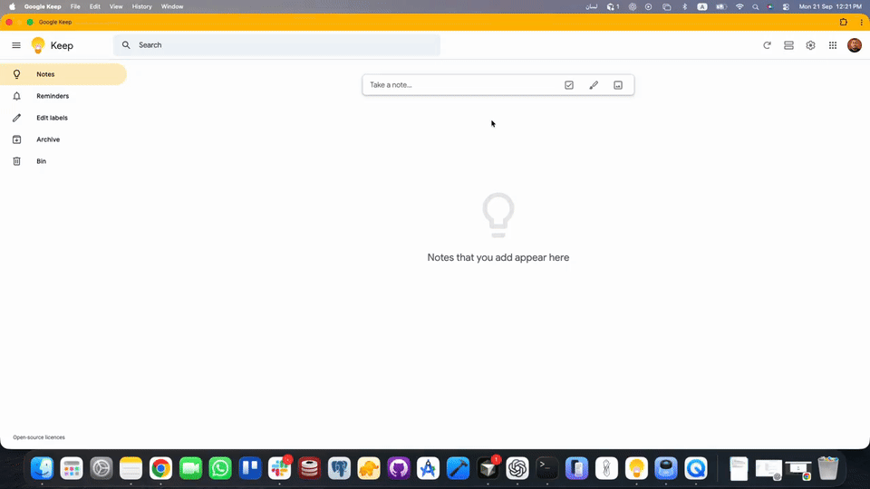

# lisan (لسان)

A macOS menu-bar helper for two typing modes:

- **Arabic transliteration:** type `marhaba` then Space → `مرحبا`.
- **Polish:** rewrite the current sentence with OpenAI using `⌘⇧R`.



## Setup

```bash
git clone https://github.com/ahmadfreijeh/lisan.git
cd lisan
python3 -m venv .venv
source .venv/bin/activate
pip3 install -r requirements.txt
python3 lisan_app.py
```

## macOS permissions

lisan needs both **Accessibility** and **Input Monitoring**:

1. Open **System Settings → Privacy & Security**.
2. Enable the app used to launch lisan in both permission panes.
   - Running from the Cursor terminal? Enable **Cursor**.
   - Running from Terminal? Enable **Terminal**.
3. Fully quit and reopen that app before starting lisan again.

Do not try to add `.venv/bin/python3`; macOS normally accepts the launcher
app, not the Python file.

## Use

Run `python3 lisan_app.py`, then click **Start** from the `لسان` menu-bar
icon. Choose a mode:

- **Arabic transliteration** translates a Latin word when you press Space.
  Press `F2` immediately after a replacement to cycle alternatives.
- **Polish (⌘⇧R)** rewrites the sentence typed since the last sentence
  boundary. An inline `...` and `لسان ⏳` appear while it works; extra shortcut
  presses are ignored until it finishes.

Use **Run in** to limit either mode to one app.

## OpenAI key

For Polish, paste your key into `OPENAI_API_KEY` in `lisan_polish.py`.
The model is also set there and defaults to `gpt-5.4-mini`.

## Safety

Never use lisan in password fields. Polish sends text only when you press
`⌘⇧R`; it cancels if you keep typing or switch apps.
